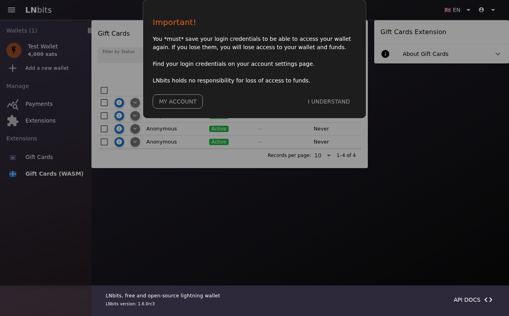
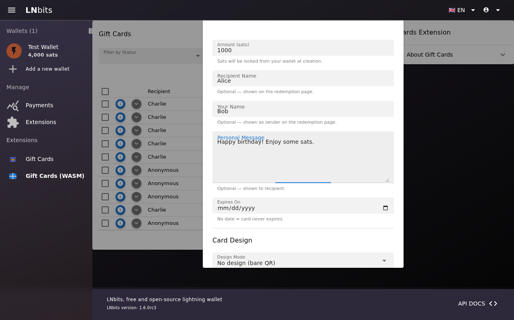
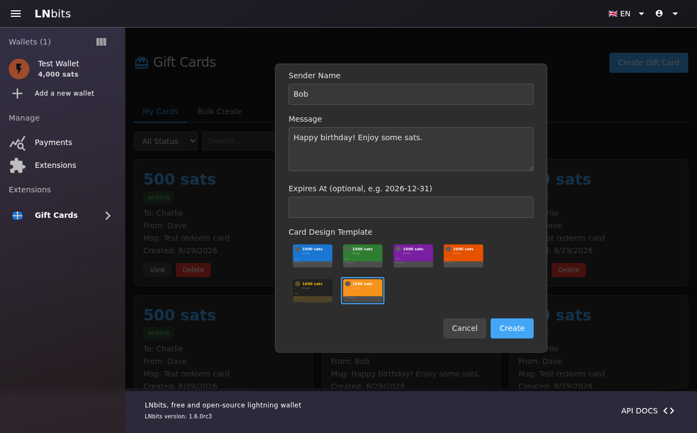
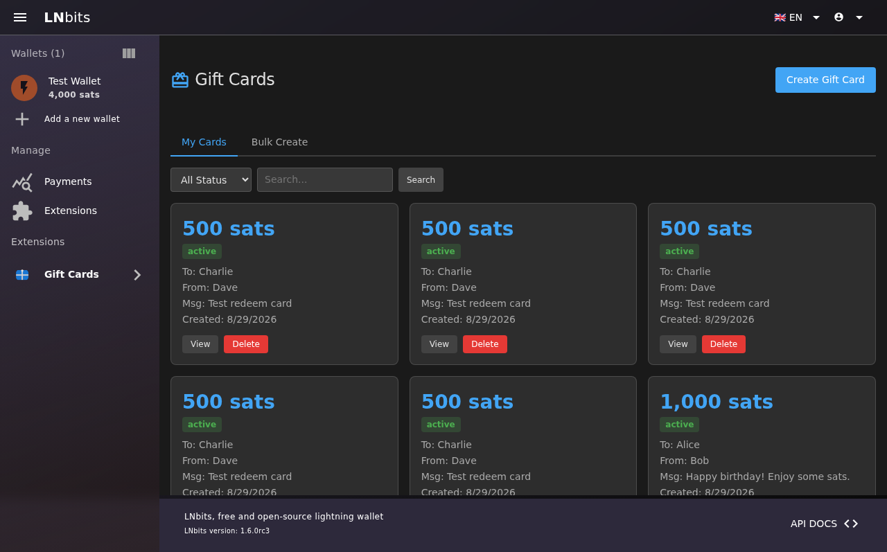
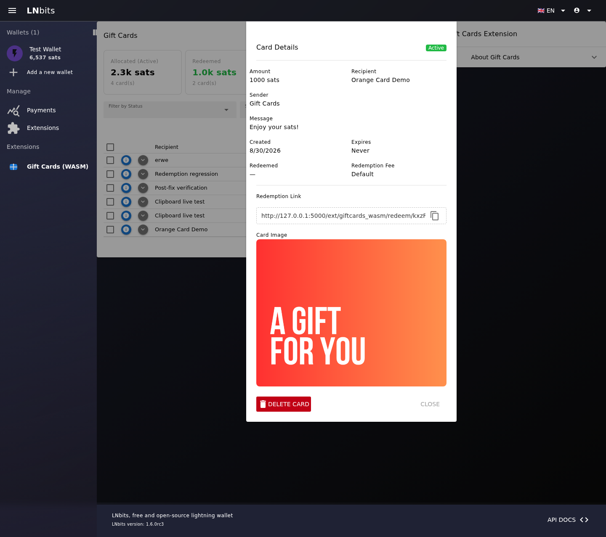
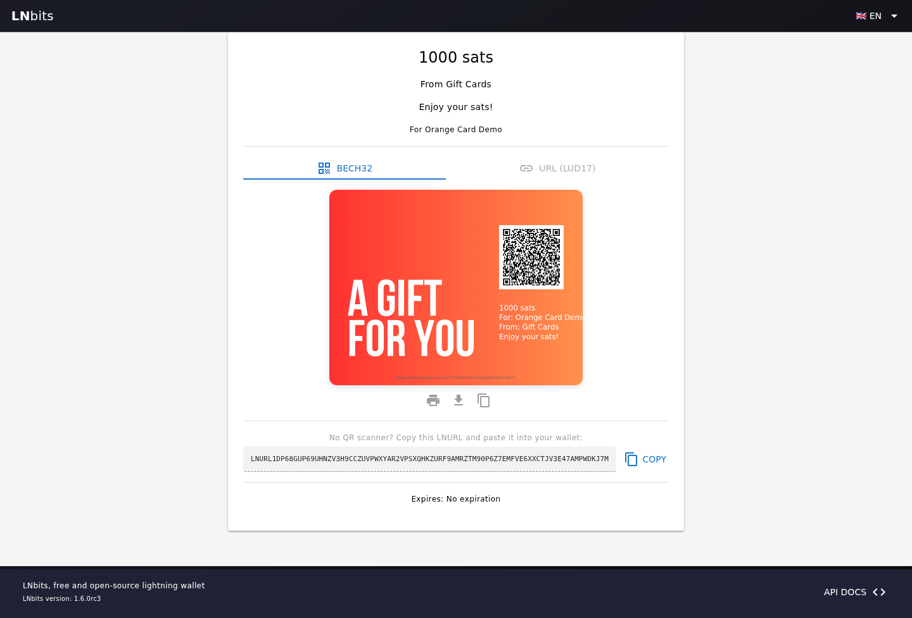

# giftcardswasm

<p align="center">
  
</p>

A WASM Component Model extension for [LNbits](https://lnbits.com) that lets wallet owners create, send, and redeem Bitcoin Lightning gift cards. Ported from the original Python `giftcards` extension to a WASM module targeting LNbits v1.6.0-rc3+ with the WASM extension runtime.

## Features

- **Create gift cards** — mint a card with a chosen amount (sats), recipient info, sender name, message, and expiry
- **Design templates** — choose from eight themed designs plus portrait and landscape layouts
- **LNURL-withdraw redemption** — each card has an LNURL-withdraw URL; recipients redeem via any Lightning wallet
- **QR code rendering** — client-side canvas QR codes for easy scanning (no server-side image generation)
- **Public redeem page** — shareable link (`/ext/giftcardswasm/redeem/{token}`) showing card details and QR
- **Bulk create / delete** — manage many cards at once
- **Lazy expiry** — expired cards are detected on access without a background cron

## Architecture

```text
LNbits page
└── WASM extension wrapper
    └── Sandboxed Vue iframe
        ├── Management UI
        ├── Public redemption UI
        └── LNbitsBridge (MessageChannel/postMessage)
                │
                ▼
        LNbits WASM route adapter
                │
                ▼
        Rust component exports
        ├── Extension storage host API
        └── Wallet payment host API
```

The browser UI cannot access LNbits APIs directly because the extension iframe uses a restrictive Content Security Policy. `static/js/bridge.js` sends approved requests to the parent wrapper, which validates the route and performs the same-origin API call. LNbits then invokes the matching Rust component export defined in `wasm/wit/world.wit`.

### Redemption flow

1. The authenticated management page creates a card through `create-card`.
2. The Rust component generates a random raw token, uses its SHA-256 hash as the card record key, stores the card, and returns a shareable redemption URL.
3. The public redemption page hashes the URL token in the browser, loads the public card fields, and renders the selected design and LNURL-withdraw QR code.
4. A Lightning wallet requests `lnurl-params`, creates an invoice for the fixed card amount, and calls `lnurl-callback`.
5. The callback locks the card in the `redeeming` state, pays the invoice through the wallet host API, and marks the card `redeemed` after success. Failed payments return the card to `active` so redemption can be retried.
6. Expiration is checked lazily whenever a card is read.

### Project structure

```text
giftcardswasm/
├── config.json                  # Manifest, routes, exports, and permissions
├── build-templates.js           # Precompiles CSP-safe Vue render functions
├── wasm/
│   ├── Cargo.toml               # Rust component package
│   ├── src/lib.rs               # Card lifecycle and LNURL logic
│   ├── src/bindings.rs          # Generated WIT bindings
│   └── wit/world.wit            # Guest exports and host imports
├── storage/
│   ├── schema.json              # Card storage schema
│   └── migrations/              # Versioned schema changes
├── templates/
│   ├── index.html               # Authenticated management page
│   └── redeem.html              # Public redemption page
├── static/
│   ├── js/bridge.js             # Sandboxed iframe bridge client
│   ├── js/index.js              # Management UI behavior
│   ├── js/redeem.js             # Redemption UI and LNURL rendering
│   ├── js/*-template.js         # Precompiled Vue render functions
│   ├── css/                     # Page and dark-mode styles
│   ├── image/                   # Full-size card designs
│   └── assets/icon.png          # Extension icon
└── tests/
    ├── e2e/giftcardswasm.spec.ts
    └── giftcards.spec.js
```

### WASM exports

The Rust module targets `wasm32-wasip1` and exchanges JSON strings with the LNbits WASM runtime.

| Function | Access | Purpose |
|---|---|---|
| `create-card` | Authenticated | Create a card and redemption token |
| `get-cards` | Authenticated | List cards with optional filters |
| `get-card` | Authenticated | Return card details |
| `update-card` | Authenticated | Update card metadata and design |
| `delete-card` | Authenticated | Delete a card |
| `bulk-create` | Authenticated | Create multiple cards |
| `get-public-card` | Public | Return safe redemption-page fields |
| `lnurl-params` | Public | Return LNURL-withdraw parameters |
| `lnurl-callback` | Public | Pay the recipient invoice and complete redemption |

### CSP Compliance

WASM extension iframes have a strict Content Security Policy:
- `script-src` — only same-origin extension assets, with no inline scripts or `unsafe-eval`
- `style-src-attr 'none'` — no inline styles (all CSS is loaded from extension assets)
- `connect-src 'none'` — no direct `fetch()`/XHR (API calls use the `LNbitsBridge`)

The frontend uses CSP-safe JavaScript, precompiled Vue templates, and the `LNbitsBridge` for API communication.

## Screenshots

### Gift Cards Admin Page


### Create Gift Card Dialog


### Template Selection


### Card Created Successfully


### Card List View


### Card Details and Design


### Public Redeem Page with Orange Card Design


## Installation

### Prerequisites

- LNbits v1.6.0-rc3 or later (dev branch) with WASM extension support enabled
- Rust toolchain with `cargo-component` and `wasm-tools`

### Build the WASM module

```bash
cd wasm
cargo component build --release
cp target/wasm32-wasip1/release/giftcardswasm.wasm module.wasm
```

The tracked `wasm/module.wasm` file is the module included in tagged release archives.

### Install the extension

Copy the extension directory into LNbits' WASM extensions folder:

```bash
cp -r giftcardswasm /path/to/lnbits/data/wasm_extensions/giftcardswasm
```

Restart LNbits. The extension will appear in the navigation drawer.

### Configuration

The `config.json` manifest defines the WASM module and WIT world, authenticated and public card routes, admin and redemption pages, and the storage and wallet permissions required by the extension.

## Development

### Playwright Tests

The repository includes Playwright end-to-end tests that verify login, card creation and management, card details, LNURL redemption, and sandbox-safe image actions.

```bash
npm install
npx playwright install chromium
npx playwright test
```

Tests require a running LNbits instance with:
- A test user (`testuser` / `testpass123`)
- A funded wallet (4000+ sats)
- The giftcards extension installed

Screenshots are saved to `screenshots/`.

### Card Design Templates

Full-size themed designs are PNG images in `static/image/` using the `template_<Name>.png` naming convention. To add a built-in design:

1. Add the PNG to `static/image/`.
2. Add its name and dimensions to `sampleTemplates` in `static/js/index.js` and `static/js/redeem.js`.
3. Rebuild the precompiled templates with `node build-templates.js`.

## License

MIT
