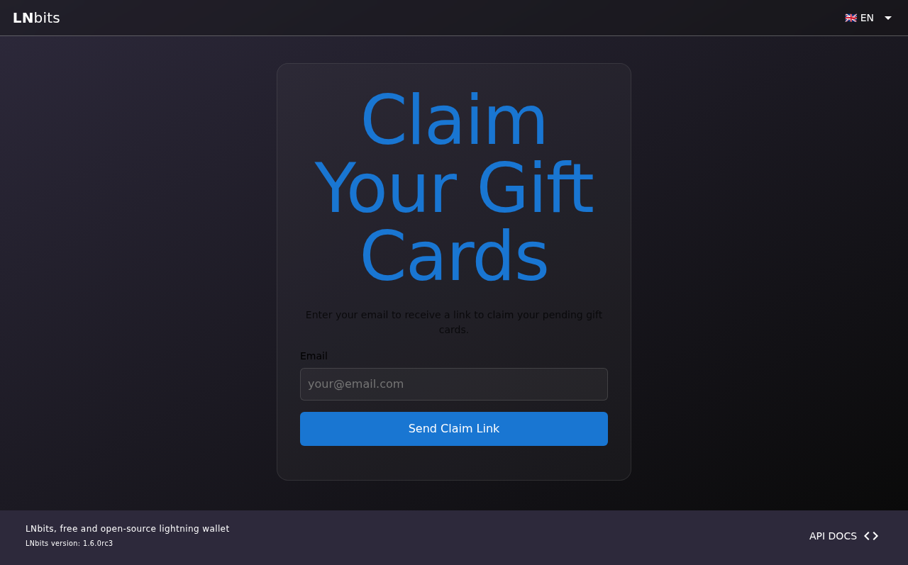

# giftcards-wasm

A WASM Component Model extension for [LNbits](https://lnbits.com) that lets wallet owners create, send, and redeem Bitcoin Lightning gift cards. Ported from the original Python `giftcards` extension to a WASM module targeting LNbits v1.6.0-rc3+ with the WASM extension runtime.

## Features

- **Create gift cards** — mint a card with a chosen amount (sats), recipient info, sender name, message, and expiry
- **Design templates** — pick from 6 built-in card designs (blue, green, purple, orange, dark, bitcoin)
- **LNURL-withdraw redemption** — each card has an LNURL-withdraw URL; recipients redeem via any Lightning wallet
- **QR code rendering** — client-side canvas QR codes for easy scanning (no server-side image generation)
- **Public redeem page** — shareable link (`/ext/giftcards/redeem/{token}`) showing card details and QR
- **Magic link claim** — bundle multiple cards into a magic link so a recipient can claim them all at once
- **Email delivery** — optional email notification via the host's `http.request` permission
- **Bulk create / delete** — manage many cards at once
- **Lazy expiry** — expired cards are detected on access without a background cron
- **Invoice event handler** — `on-invoice-paid` marks cards as funded when the funding invoice settles

## Architecture

```
giftcards-wasm/
├── config.json              # Extension manifest: routes, permissions, WASM spec
├── wasm/                    # Rust WASM module (Component Model)
│   ├── Cargo.toml
│   ├── src/
│   │   ├── lib.rs           # Core gift card logic + host bindings
│   │   └── bindings.rs      # Auto-generated WIT bindings
│   └── wit/
│       └── world.wit        # WIT interface (host imports + exports)
├── storage/
│   ├── schema.json          # Table definitions: cards, magic_links
│   └── migrations/
│       └── 001_init.json    # Initial migration
├── templates/               # HTML pages (CSP-safe, vanilla JS)
│   ├── index.html           # Admin management UI
│   ├── redeem.html          # Public redemption page
│   └── claim.html           # Public magic-link claim page
└── static/
    ├── js/
    │   ├── bridge.js        # LNbitsBridge postMessage helper
    │   ├── index.js         # Admin UI logic
    │   ├── redeem.js        # Redeem page logic
    │   ├── claim.js         # Claim page logic
    │   ├── qr-helper.js     # QR canvas rendering
    │   └── qrcode.min.js    # QR code library
    ├── css/
    │   ├── index.css
    │   ├── redeem.css
    │   └── claim.css
    ├── templates/           # Card design preview images
    │   ├── blue.png
    │   ├── green.png
    │   ├── purple.png
    │   ├── orange.png
    │   ├── dark.png
    │   └── bitcoin.png
    └── assets/
        └── icon.png         # Extension icon
```

### WASM Module

The Rust module compiles to `wasm32-wasip1` using `cargo-component`. It imports host functions from `lnbits:extension/host` for storage, invoice creation, and HTTP requests. All exports use JSON string serialization for parameters and return values.

**Exported functions:**

| Function | Type | Description |
|---|---|---|
| `create-card` | authenticated | Create a new gift card |
| `get-cards` | authenticated | List cards with optional status filter |
| `get-card` | authenticated | Get single card by ID |
| `update-card` | authenticated | Update card details |
| `delete-card` | authenticated | Delete a card |
| `bulk-create` | authenticated | Create multiple cards |
| `bulk-delete` | authenticated | Delete multiple cards |
| `deliver-email` | authenticated | Send email notification |
| `get-public-card` | public | Get card info by token hash (no auth) |
| `lnurl-params` | public | Return LNURL-withdraw parameters |
| `lnurl-callback` | public | Process LNURL-withdraw callback |
| `claim-cards` | public | Claim cards via magic link |
| `verify-claim` | public | Verify a magic link token |
| `on-invoice-paid` | event | Mark card funded when invoice settles |

### CSP Compliance

WASM extension iframes have a strict Content Security Policy:
- `script-src` — only same-origin ext-assets, no `unsafe-eval` (no Vue.js)
- `style-src-attr 'none'` — no inline styles (all CSS in external files)
- `connect-src 'none'` — no `fetch()`/XHR (all API calls via `postMessage` bridge)

All frontend code is vanilla JavaScript using the `LNbitsBridge` for API communication.

## Screenshots

### Gift Cards Admin Page


### Create Gift Card Dialog


### Template Selection


### Card Created Successfully


### Card List View


### Card Detail with QR Code


### Public Redeem Page


### Magic Link Claim Page


## Installation

### Prerequisites

- LNbits v1.6.0-rc3 or later (dev branch) with WASM extension support enabled
- Rust toolchain with `cargo-component` and `wasm-tools`

### Build the WASM module

```bash
cd wasm
cargo component build --release
```

This produces `wasm/target/wasm32-wasip1/release/giftcards_wasm.wasm`.

### Install the extension

Copy the extension directory into LNbits' WASM extensions folder:

```bash
cp -r giftcards-wasm /path/to/lnbits/data/wasm_extensions/giftcards
```

Restart LNbits. The extension will appear in the navigation drawer.

### Configuration

The `config.json` manifest defines:
- **WASM module path** and WIT world
- **14 exported functions** (public, authenticated, and event)
- **13 API routes** mapped to exports
- **4 UI routes** (admin index, redeem, claim, + LNURL callback)
- **12 permissions** (storage read/write, invoice create/pay, HTTP request, etc.)

## Development

### Playwright Tests

The repository includes Playwright end-to-end tests that verify the full flow: login, create card, view list, view detail with QR, redeem page, and claim page.

```bash
npm install
npx playwright install chromium
npx playwright test
```

Tests require a running LNbits instance with:
- A test user (`testuser` / `testpass123`)
- A funded wallet (4000+ sats)
- The giftcards extension installed

Screenshots are saved to `screenshots/`.

### Card Design Templates

Templates are PNG images in `static/templates/`. Each template is a 400x250 card preview. To add a new template:

1. Add a PNG to `static/templates/` (e.g., `rainbow.png`)
2. Add an `` element to the template selector in `templates/index.html`
3. The selected template name is stored in the card's `designJson` field

## License

MIT
